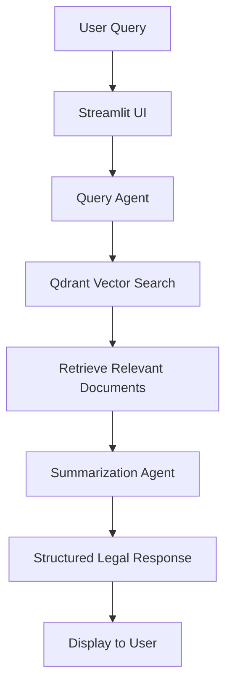

# ⚖️ Legal AI Assistant

## 🌟 Project Overview

The Legal AI Assistant is an advanced Streamlit-based application that leverages AI and vector search technology to provide intelligent legal research and document retrieval. It uses CrewAI agents, OpenAI's language models, and Qdrant vector database to fetch and summarize relevant legal information instantly.

## 🎥 Demo Video

https://github.com/user-attachments/assets/adb7a375-314f-4738-93c4-befbf45e2407

## 🏗️ System Architecture



## ✨ Features

- 🔍 Advanced legal document search
- 📄 Intelligent document retrieval
- 📖 Contextual summarization
- 🤖 AI-powered legal research assistant
- 💻 User-friendly Streamlit interface

## 🛠️ Tech Stack

- Python
- Streamlit
- CrewAI Agnetic Freamework
- OpenAI GPT Models
- Qdrant Vector Database
- LangChain
- PDFPlumber

## 🚀 Setup and Installation

### Prerequisites

- Python 3.8+
- OpenAI API Key
- Qdrant Vector Database cloud Credentials

### Installation Steps

1. Clone the repository
```bash
git clone https://github.com/yourusername/legal-ai-assistant.git
cd legal-ai-assistant
```

2. Create a virtual environment
```bash
python -m venv venv
source venv/bin/activate  # On Windows, use `venv\Scripts\activate`
```

3. Install dependencies
```bash
pip install -r requirements.txt
```

4. Set up environment variables
Create a `.env` file with the following:
```
OPENAI_API_KEY=your_openai_api_key
QDRANT_URL=your_qdrant_url
QDRANT_API_KEY=your_qdrant_api_key
```

5. Prepare Legal Documents
- Place PDF documents in the `./data` directory

6. Initialize Vector Database
```bash
python qdrant_loader.py
```

7. Run the Streamlit App
```bash
streamlit run app.py
```

## 🧩 Project Components

### 1. PDF Loader (`qdrant_loader.py`)
- Extracts text from PDFs
- Generates embeddings
- Loads documents into Qdrant vector database

### 2. Streamlit App (`app.py`)
- User interface
- Manages AI agents and workflow
- Displays legal research results

## 🤔 Issues Faced During Development

1. **Embedding Generation**: Initial challenges with embedding consistency and size
2. **Vector Search Accuracy**: Tuning relevance thresholds for precise document retrieval
3. **Performance Optimization**: Managing batch processing and API rate limits

## 🚧 Future Enhancements

- [ ] Multi-language support
- [ ] Advanced filtering of legal documents
- [ ] User authentication
- [ ] Caching mechanism for faster responses
- [ ] Contextual follow-up question support
- [ ] Citation and source tracking
- [ ] Export of research results

## 🤝 Contributing

1. Fork the repository
2. Create your feature branch (`git checkout -b feature/AmazingFeature`)
3. Commit your changes (`git commit -m 'Add some AmazingFeature'`)
4. Push to the branch (`git push origin feature/AmazingFeature`)
5. Open a Pull Request

## 📄 License

Distributed under the MIT License. See `LICENSE` for more information.

## 📞 Contact

Your Name - [Your Email]
Project Link: [https://github.com/yourusername/legal-ai-assistant](https://github.com/yourusername/legal-ai-assistant)

---

**Disclaimer**: This tool is for research and educational purposes. Always consult professional legal advice for specific legal matters.
